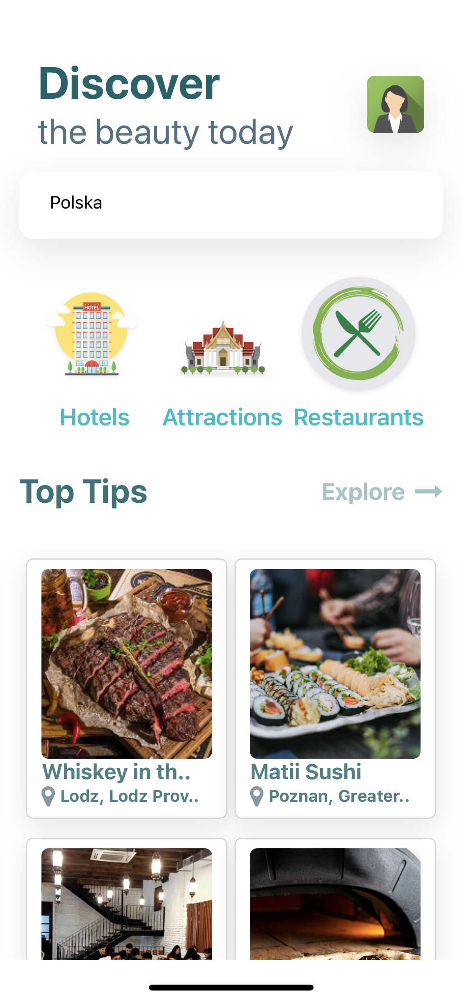
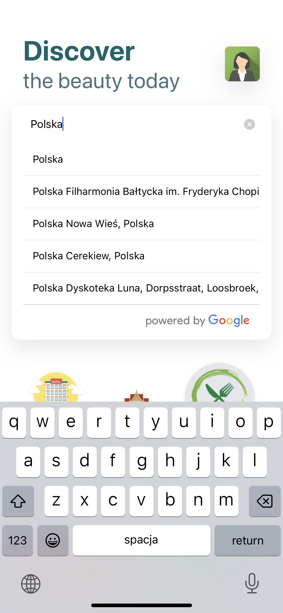

## Travel App using React Native with Typescript Expo and Google API by [@planetoida90210](http://github.com/planetoida90210)!

## Hi!

This is a sample project for a travel app using React Native Expo with TypeScript and fetching data from Google API.

App is created with [REACT NATIVE](https://reactnative.dev/) styled with [TAILWIND CSS](https://tailwindcss.com/).

### Prerequisites

* Node.js (v12 or newer)
* npm (v6 or newer)
* Expo CLI (`npm install -g expo-cli`)
* Google API Key (You can create one [here](https://developers.google.com/maps/get-started?hl=pl#create-project))

### Getting Started

1. Clone the repository
2. Install dependencies: `yarn install`
3. Create a `.env` file in the root directory and add your Google API Key as `GOOGLE_PLACES_API_KEY=<your_api_key>`
4. Change headers of `X-RapidAPI-Key` inside api/index.js to Your api key - from [here](https://rapidapi.com/apidojo/api/travel-advisor/)
5. Start the development server: `yarn start`
6. Select runtime device (IOS or ANDROID)

If u have Expo account just simply scan QR code from top documentation and run on Your device.

### Features

* Fetches data from Google Places API to display nearby places, including restaurants, tourist attractions, and hotels.
* Users can search for places using keywords or a specific location.
* Users can view details about each place, including ratings, reviews, and photos.

### Libraries Used

* React Native
* Expo
* TypeScript
* React Navigation
* Axios
* Google Places API

It works nice on IOS and ANDROID mobiles

## Thanks !
